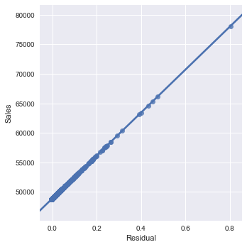

# Iowa Liquor Stores Problem on SparkML with Scala.


# Introduction

The objective of this project is to advise a hypothetical owner of liquor stores chain where to open new stores and where the best opportunities in the state of Iowa liquor market are. The data is comprised of historical sales and location information. 

# Data Wrangling and Data Munging

The dataset do not had many missing values and is professionally redacted but, in order to submit this information into a machine learning alghoritm it needs to be converted and arranged in a numeric format. A peculiarty to spark is that needs to
to process data as vectors. It sees all the row of the datset as a vector with an associated label hence, the need to change the name of the target variable column to "label". The following snippet of the codes is an examplot of converting the field expressed as dollar to a numeric entry, firt the dollar sign must be remove and then the character strinbg coverted to a double precision number. 
```                                                                                                                                                                              val df1=df_rdx.withColumn("Sale (Dollars)", regexp_replace($"Sale (Dollars)","\\$+", " "))

  val df2=df1.withColumn("State Bottle Retail", regexp_replace($"State Bottle Retail","\\$+", " "))

  val df3=df2.withColumn("Sale (Dollars)", $"Sale (Dollars)".cast(sql.types.DoubleType))

  val df4=df3.withColumn("State Bottle Retail", $"State Bottle Retail".cast(sql.types.DoubleType))

  val df_preprocessed=df4.withColumnRenamed("Sale (Dollars)","label")
```
After this step the dataset is ready for more complex techniques as feature selection and engineering as well as further preprocessing.

# SparkML library.

In contrast to R or Python, Scala uses the get/set paradigm to assigned parameters to an object. The SparkML library has two APIs one for RDD(Resilient Distributed Dataset) and for DATAFRAME, the newest one, which some expets considered to be the future of Spark. Although the SparkML by any standard, is a capable machine learning library but, still need more development in certains area to be on pair with other packages such as Python or R but, this is a challange due to Spark backbone on paraller computing and cluster data distribution schema but something that for certain it will be tackle in the near future. The following code snippet is the initialization of a linear regression object, and the assigment of certain hyperparameters.
```
val lr= new LinearRegression()
        .setFitIntercept(true)      
        .setStandardization(true)       
        .setTol(0.007)
        .setMaxIter(500)        
        .setFeaturesCol("features")
```
The metrcis and evaluators used in my Python code yielded very similar results to those implemented on the Scala code, in essence are the same statistical variables. Python and R can be tools to prototyped models before deployment into a big data plataforms that uses Scala.


# Tuning a model with Scala.

The model is embedded in a pipeline object which simplyfied the tuning and cross validation of the model.
```
 val pipeline = new Pipeline()
                   .setStages(Costumed_Stages)
```
The only significant difference between tuning a model in Scala to tuning a model in a package like R is the method build() which will generated the grid of hyperparameters for the tuning but if is not called the grid will be created but not excuted.

```
val paramGrid = new ParamGridBuilder()
                    .addGrid(lr.regParam,reg_param)
                    .addGrid(lr.elasticNetParam,alpha)
                    .addGrid(lr.loss,loss_func)
                    .addGrid(lr.solver,solvers)
                    .build()
```
In SparkML cross validation and hyperparameters tuning are integrated.
``` 
val cv = new CrossValidator()
            .setEstimator(pipeline)
            .setEstimatorParamMaps(paramGrid)
            .setEvaluator(r2Evaluator)
```
Making tasks like selecting the best set of hyperparameters and evaluation a single line of code action.

# Conclusions

In all regression problems residual error analysis is fundamental to understand not only the accuracy of the model but, it also has valuable information about model fittness, interpretability, variance balance and the bias/variance structure of the model. The picture bellow is a graph of y against athe residual errors:



The image above shows how well fit is the regression is to the data but also, can be infered the there is no unbalance variance and the magnitud of the resiudal errors. Here is the Scala source code object: [lr_model](/iowarliuorestoresproblem/src/com/salazaraiassociates/spark/lr_model.scala) or the Databricks notebool [Iowa_Liquor_Stores_Problem_on_SparkML](https://databricks-prod-cloudfront.cloud.databricks.com/public/4027ec902e239c93eaaa8714f173bcfc/5557002591186765/134647401198801/211402702664379/latest.html)

# License

This project is licensed under the Apache 2.0 License - see the [LICENSE](LICENSE) file for details.

